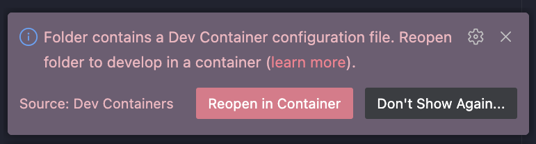

## How to develop this code base inside a container 
### AUTHOR: Cole
### DATE: 04 January 2026

There are lots of ways to develop inside a container, and we're not making a statement about which one is best. This is just a quick how-to for ourselves and anyone else who comes along who wants to develop part of the workflow and ensure that the containerization is being made use of. 

We put the `/.devcontainer/devcontainer.json` file in the repo so that VS Code can create a development container based off the tools needed to work with this codebase. There's a [nice tutorial](https://code.visualstudio.com/docs/devcontainers/tutorial) that shows users how to make use of the container when they're actually developing. 

If everything you need is installed correctly, then when you open this folder in VS Code, you should see a pop-up like this: 

You will want to reopen the folder in the container. If such a pop-up does NOT come up, you can use the command palette (`Cmd`+`Shift`+`P`) and then type `Dev Containers: Reopen in Container`. This will start your docker engine automatically and connect you to the container. You can check that the terminal is then *actually* pointing to the container by running something like `cat /etc/os-release` which will tell you what OS the terminal is looking at (i.e. which OS the container is running. It should (as of this writing) be running Ubuntu 22.04.5). 

Once you're up and running in the container, you can write code and develop the same as normal!